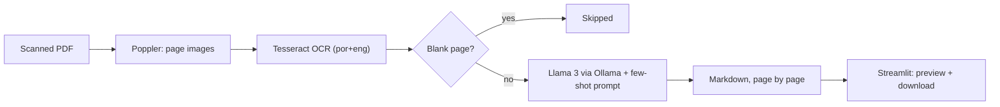

# LLM-Based Doc Scan: Scanned PDFs to Structured Markdown with a Local LLM

Upload a scanned PDF and get clean Markdown back: Poppler rasterizes each page, Tesseract reads the text (Portuguese and English), and a local Llama 3 model served by Ollama rebuilds headings, lists, and tables. Everything runs on your machine with Docker Compose; no document leaves it and no API key is needed.

[](https://github.com/Brilhante29/llm-based-doc-scan/actions/workflows/ci.yml)
[](LICENSE)


## Why this exists

OCR alone returns a flat stream of text: tables collapse into lines, headings lose their hierarchy, and the result is hard to search or feed into other systems. Cloud document-AI services fix that, but many documents (contracts, medical or personal records) should not be uploaded anywhere. This project combines classic OCR with a local LLM, using a few-shot prompt, to recover the structure while keeping the data on-premises.

## How it works



- `app/pipeline.py` holds the orchestration and depends only on three callables (render pages, extract text, write Markdown), so it is unit-tested without Tesseract, Poppler, or a model.
- `app/main.py` is a thin Streamlit UI: side-by-side PDF preview and generated Markdown, a progress bar per page, and a download button. Results are cached per file, so downloading does not reprocess the document.
- Model output comes from untrusted documents, so it is rendered as Markdown only, never as raw HTML.

## Quickstart

Requirements: Docker with Compose.

```bash
docker compose -f docker/docker-compose.yaml up --build
```

On the first start, the one-shot `ollama-pull` service downloads the model (about 4.7 GB for `llama3`) into `docker/ollama_data/`; the app starts after the download completes. Then open [http://localhost:8501](http://localhost:8501) and upload a PDF ([`pdfs/documento.pdf`](pdfs/documento.pdf) is a synthetic sample).

Configuration (environment variables, read by Compose):

| Variable | Default | Purpose |
|---|---|---|
| `OLLAMA_MODEL` | `llama3` | Model pulled and used for structuring |
| `OCR_LANG` | `por+eng` | Tesseract language set |
| `OLLAMA_BASE_URL` | `http://ollama:11434` in Compose | Ollama endpoint used by the app |

Example with a smaller model: `OLLAMA_MODEL=llama3.2 docker compose -f docker/docker-compose.yaml up --build`.

Stop with `docker compose -f docker/docker-compose.yaml down`. Ports are bound to `127.0.0.1` only.

## Development

```bash
python -m venv .venv && . .venv/bin/activate
pip install -r requirements-dev.txt
python -m ruff check app tests
python -m pytest -q
```

To run the UI outside Docker, install `requirements.lock`, plus Tesseract (with the Portuguese language pack) and Poppler from your OS packages, start Ollama locally, and run `streamlit run app/main.py`.

The exploratory notebook in [`notebooks/OCR_LLM/`](notebooks/OCR_LLM/) shows the zero-shot prompt that preceded the current few-shot prompt.

## Design decisions

| Decision | Why | Trade-off |
|---|---|---|
| Tesseract OCR before the LLM | Deterministic text extraction; the model only restructures | Weak on handwriting and low-quality scans |
| Local Llama 3 through Ollama | Documents never leave the machine; no API cost | Slower than hosted models; quality depends on model size |
| Few-shot prompt with a table example | Teaches the expected Markdown structure | Longer prompts per page |
| Skip blank pages | Avoids wasted inference and invented content | Pages with only images produce no output |
| Pinned dependencies and base image | Reproducible builds | Updates are explicit |

## Limitations

- No layout-aware OCR: multi-column pages and complex tables can be reordered.
- Charts and images are not interpreted; only their OCR text is used.
- Pages are processed sequentially, so long documents take time on CPU.
- No automatic quality evaluation of the generated Markdown yet.

## Project structure

```text
app/
  pipeline.py        orchestration and adapters (Poppler, Tesseract, Ollama)
  main.py            Streamlit UI
  Dockerfile         app image with Tesseract (por, eng) and Poppler
docker/
  docker-compose.yaml  Ollama, one-shot model pull, and the app
tests/               unit tests for the pipeline
notebooks/           exploration notebook
pdfs/                synthetic sample document
requirements.txt     direct dependencies; requirements.lock pins the full set
```

## Related work

- [rag-knowledge-base](https://github.com/Brilhante29/rag-knowledge-base): retrieval over documents with reproducible evaluation.
- [llm-eval-harness](https://github.com/Brilhante29/llm-eval-harness): contract-first scoring of LLM outputs against references.
- [cost-aware-inference](https://github.com/Brilhante29/cost-aware-inference): latency, tokens, and price of local versus hosted models.

## Author

**Guilherme Brilhante**, software engineer working on scalable backends and production AI.
[LinkedIn](https://www.linkedin.com/in/guilhermefreirebrilhanteseveriano/) · [GitHub](https://github.com/Brilhante29) · [Publications](https://dblp.org/pid/353/6812.html)

## License

[MIT](LICENSE).
